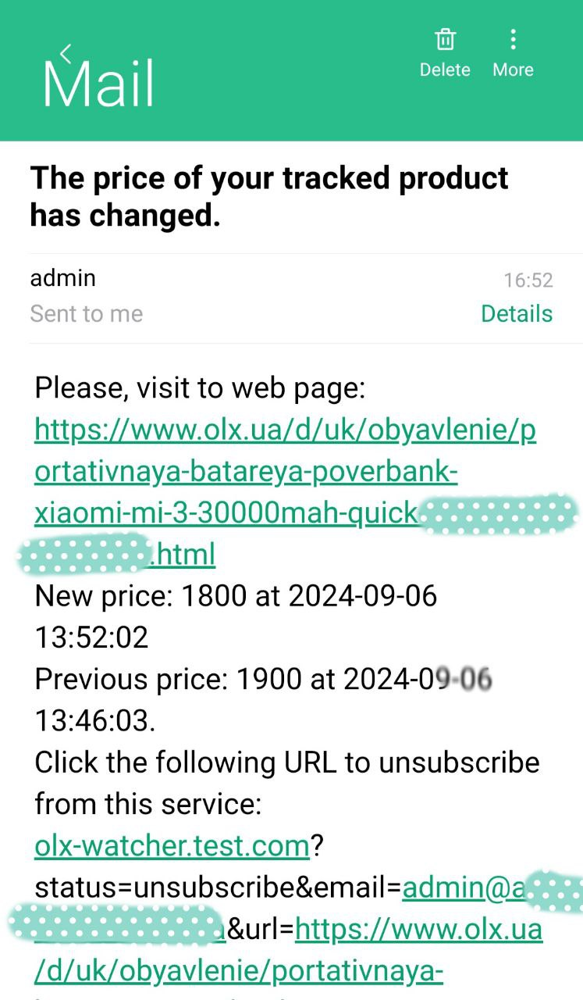

# olx-watcher

Tracking OLX product prices and price changes


[](https://github.com/Igor-ad/olx-watcher/)


### Requirements:

PHP ^8.2, composer, git, docker, redis or file storage,
composer/autoload psr-4

```
Init cmd:
cd /projects
git clone https://github.com/Igor-ad/olx-watcher.git
cd /projects/olx-watcher
cp ./src/config.ini.examlpe ./src/config.ini
chmod 777 ./src/olx_watcher.log
chmod 777 ./src/subscribe.db
composer install
docker-compose up
```

In the last version of the application implements a replacement of the storage type. Changed JSON storage to serialized
storage. The storage now stores serialized Subject objects instead of object hashes as arrays.

Product price checking service: OlxWatcher\Services\WatcherService

Subscription Service: OlxWatcher\Services\SubscribeService

Parser script of products price: OlxWatcher\Parsers\Parser

Saving subscribers and prices of products is implemented in serialized storage in the file: src/subscribe.db

Possible to use file cache & SubjectCollection: OlxWatcher\Database\FileRepository
or Redis cache & SubjectCollection: OlxWatcher\Database\RedisRepository.

Sample subscription storage file: src\subscribe_example.db

The mailing uses sendmail: OlxWatcher\Notifiers\MailNotifier.

All operations are logged to the file:  src/olx_watcher.log.

To subscribe, you need to make a GET request with two parameters:
your email address and URL of the source OLX - advertisements for the sale of product.

Example:

```
http://example-olx-watcher/?status=subscribe&email=test@mail.com&url=https://www.olx.ua/powerbank.html
```

To unsubscribe from all subscriptions you must send a GET request:

```
http://example-olx-watcher/?email=test@mail.com&status=unsubscribe
```

The cron script checks every 15 minutes for changes in the price of a product and, if there is a change, sends emails to
subscribers.

For example, the structure of the Subject subscription object is given as a JSON array. In the last version, these are
serialized Subject objects.

```
{
    "https://www.olx.ua/d/uk/obyavlenie/korpus-ups-dbzh-ups-dlya-routera-SdWRvYr.html": {
        "previous_price": "120",
        "last_price": "120",
        "previous_time": "2025-01-07 08:28:35",
        "last_time": "2025-01-07 08:28:35",
        "subscribers": [
            "test3@mail.com",
            "test4@mail.com",
            "test1@mail.com",
            "test2@mail.com"
        ],
        "has_update": true
    },
    "https://www.olx.ua/d/uk/obyavlenie/samsung-inr-18650-35e-DSrAt.html": {
        "previous_price": "80",
        "last_price": "80",
        "previous_time": "2025-01-07 08:43:06",
        "last_time": "2025-01-07 08:43:06",
        "subscribers": [
            "test1@mail.com",
            "test2@mail.com",
            "test3@mail.com"
        ],
        "has_update": false
    }
}
```

### Example email:


